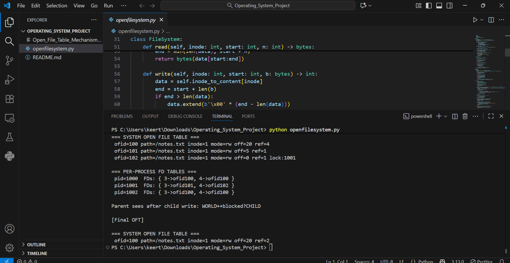

# 🔧 Open File Table Mechanism – Python Simulation

This project is a small, self-contained simulation of core operating-system file semantics in Python: processes, per-process file descriptor tables, a system-wide Open File Table (OFT), offsets, append mode, locking, `dup()` sharing, and `fork()`-style reference counting.

## 🚀 Features
- Virtual in-memory file system (path ↔ inode, inode ↔ content)
- System-wide Open File Table entries with offsets and refcounts
- Per-process file descriptor tables
- Append mode that starts writes at EOF
- Exclusive locks preventing concurrent writers
- `dup()` sharing the same OFT entry (shared offset)
- `fork()`-like behavior that increments refcounts in the OFT
- CLI configuration via `argparse`

## 🧠 Key Concepts
- Inodes and content storage using `bytearray`
- Open File Table vs per-process FD tables
- File offsets and how `dup()` shares them
- Append semantics and exclusive locking

## ⚙️ Requirements
- Python 3.8+

## ▶️ Usage
From this directory:

```bash
python openfilesystem.py --file /journal.log --init "SEED:" --append1 --w1 "AAA" --w2 "bbb"
```

or:

```bash
python openfilesystem.py --file /lab.txt --append2 --w1 "X" --w2 "YYYYY"
```

Command-line options:
- `--file`       Path of the simulated file (created if missing)
- `--init`       Initial content string to seed the file
- `--append1`    Make Process 1 open in append mode (offset at EOF)
- `--append2`    Make Process 2 open in append mode (offset at EOF)
- `--w1`         Bytes that Process 1 writes first
- `--w2`         Bytes that Process 2 writes first

What the demo does:
1) Creates two processes and opens the same file (with optional append)
2) Each writes its payload
3) Shows the OFT and per-process FD tables
4) Calls `dup()` for P1 and writes again (shared offset)
5) Demonstrates exclusive lock denial for the other process
6) Simulates `fork()` and shows refcount behavior and final content

## 🖼️ Example Output (abridged)
```
[After opens + writes]
=== SYSTEM OPEN FILE TABLE ===
 ofid=... path=/journal.log inode=... mode=a off=... ref=...
...
=== PER-PROCESS FD TABLES ===
 pid=1000  FDs: { 3->ofid..., 4->ofid... }
 ...
```

## 📸 Result Screenshot



## 📑 Presentation Slides

For a concise, visual walkthrough of the design, flow, and demo, see the slide deck:

- [Open_File_Table_Mechanism_PPT.pptx](Open_File_Table_Mechanism_PPT.pptx)

## 📁 Project Structure
```
Operating_System_Project/
├── openfilesystem.py
├── Open_File_Table_Mechanism_PPT.pptx
└── README.md
```

## 💡 Learning Value
Hands-on illustration of OS internals: system-wide OFT vs per-process FD tables, file offsets and sharing via `dup()`, append semantics, locks, and `fork()`-like reference counting — all kept simple and visible with console dumps.

